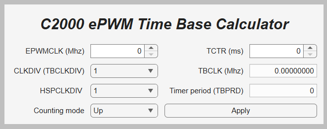

# C2000 ePWM Time Base Calculator

A *TBPRD* calculator built with MATLAB App Designer. It's tailored
for the C2000 series real-time MCUs and supports multiple counting
modes.

## Quick Install

1. Click on the **APPS** tab in the MATLAB toolstrip.

2. Click **Install App**.

3. Select `c2000_epwm_tb_calc.mltbx` (or your distributed version).

4. Find it in your Apps list and start using it.

## APP Preview

